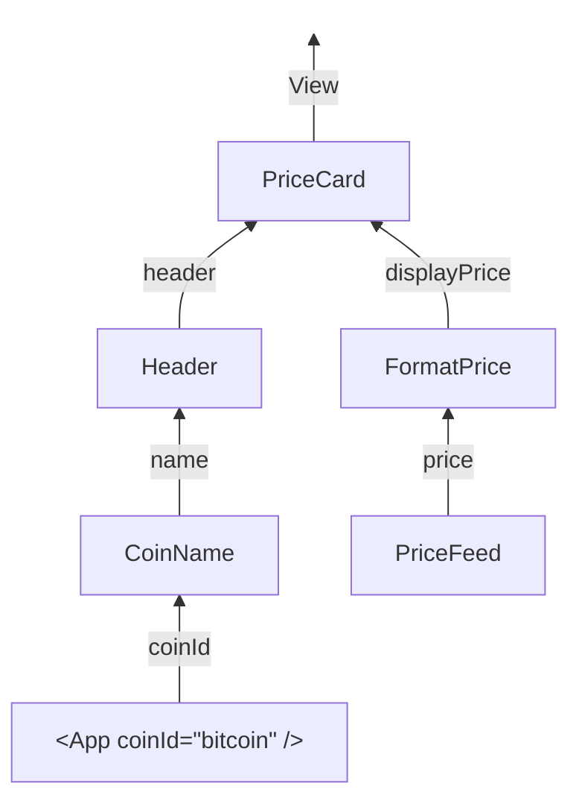

```
                                ▄▄▄▄            
                                ██▀▀▀     ██     
 ▄███▄██   ██▄████   ▄█████▄  ███████   ███████  
██▀  ▀██   ██▀       ▀ ▄▄▄██    ██        ██     
██    ██   ██       ▄██▀▀▀██    ██        ██     
▀██▄▄███   ██       ██▄▄▄███    ██        ██▄▄▄  
 ▄▀▀▀ ██   ▀▀        ▀▀▀▀ ▀▀    ▀▀         ▀▀▀▀  
 ▀████▀▀
```

_The smallest API imaginable._

# graft

Graft is sort of a programming language, but you can also think of it a tiny,
self sufficient TypeScript programming framework.

It focuses on non-linear, async friendly composition.

It is jsx friendly.

Use it for UI or anything.

You can replace React entirely, or just a part of your app (it is compatible).

The main concepts:

`component` - a runtime typed functions (which can be async).

`compose` - a way to combine components, ending up with a component again.

`compose({ into: target, from: {keyA: sourceA, keyB: sourceB } })` connects
between 3 components. The remaining unsatisfied inputs of `target`, `sourceA`
and `sourceB` bubble up as the composed component's new required inputs. The
result is (again) a component with a set of known typed inputs and output.

Turns out this is enough to do everything.

No prop drilling. No Context. No useState. No useEffect. No manual
subscriptions.

To install it -

```
npm install graftjs
```

## Why

Graft solves problems that arise in UI (e.g. in React) and non-UI programming.

React is great but has two main issues:

1. You have to sprinkle hooks everywhere, ending up with impure components or
   things like `useEffect` dependencies array, or weird hook rules.
2. You nest components within each other, coupling views which leads to prop
   drilling / signature duplication.

Have you ever chased a stale closure bug through a `useEffect` dependency array?
Or watched a parent re-render cascade through child components that didn't even
use the state that changed? Or needed to add a parameter deep in a component
tree and had to refactor every intermediate component just to thread it through?

Graft eliminates all three by design.

You describe the wiring directly, focusing on types and composition of
independent elements, which allows you to keep them decoupled and pure.

You might wonder if it's like Haskell or Elm. It's actually quite different. It
improves on linear composition and nesting which are the common patterns in
functional languages. You can compose in multiple directions, still ending up
with simple components, as unsatisfied inputs become the new component's props.
This is [graph programming](https://uriva.github.io/blog/graph-programming.html)
applied to TypeScript and UI.

## The tradeoffs

In programming, everything is a tradeoff. Graft pays for these advantages with
the following choices:

1. Runtime schemas require a library like `zod`, less neat than just using
   TypeScript types. But without it, it would be very easy to miss a dependency.
   If Graft would ever become a programming language one day, this could be
   greatly improved.
1. Most of the computation graph is eager, so if you have a ternary downstream,
   you might still compute all values for the two branches. In most cases this
   shouldn't be a problem, as the CPU intensive work is rendering and not pure
   computations. Secondly, in the future can be solved with lazy evaluation.

## Core concepts

### A component is a typed function

It takes named inputs and produces an output. That's it.

```tsx
import { z } from "zod/v4";
import { component, View } from "graftjs";

const Greeting = component({
  input: z.object({ name: z.string() }),
  output: View,
  run: ({ name }) => <h1>Hello, {name}</h1>,
});
```

The output doesn't have to be JSX. A component that returns data is just a
transform:

```tsx
const FormatPrice = component({
  input: z.object({ price: z.number() }),
  output: z.string(),
  run: ({ price }) =>
    new Intl.NumberFormat("en-US", {
      style: "currency",
      currency: "USD",
    }).format(price),
});
```

### compose wires components together

`compose({ into, from, key })` feeds `from`'s output into `into`'s input named
`key`. The satisfied input disappears. Unsatisfied inputs bubble up as the new
component's props.

```tsx
import { compose } from "graftjs";

const PriceDisplay = component({
  input: z.object({ displayPrice: z.string() }),
  output: View,
  run: ({ displayPrice }) => <span>{displayPrice}</span>,
});

// FormatPrice needs { price }, PriceDisplay needs { displayPrice }
// After compose: the result needs only { price }
const FormattedPrice = compose({
  into: PriceDisplay,
  from: FormatPrice,
  key: "displayPrice",
});
```

You can also wire multiple inputs at once:

```tsx
const Card = component({
  input: z.object({ title: z.string(), body: z.string() }),
  output: View,
  run: ({ title, body }) => (
    <div>
      <h2>{title}</h2>
      <p>{body}</p>
    </div>
  ),
});

const App = compose({
  into: Card,
  from: { title: TitleSource, body: BodySource },
});
```

## toReact converts to a regular React component

Existing react apps can adopt gradually - `toReact` gives you a standard
`React.FC`.

```tsx
import { toReact } from "graftjs";

const App = toReact(FormattedPrice);

// TypeScript knows this needs { price: number }
<App price={42000} />;
```

## emitters

In React you'd use `useEffect` + `useState` for a WebSocket, a timer, or a
browser API. In graft, that's an `emitter` — a component that pushes values over
time. Everything downstream re-runs automatically.

```tsx
import { emitter } from "graftjs";

const PriceFeed = emitter({
  output: z.number(),
  run: (emit) => {
    const ws = new WebSocket("wss://stream.binance.com:9443/ws/btcusdt@trade");
    ws.onmessage = (e) => emit(Number(JSON.parse(e.data).p));
    return () => ws.close(); // cleanup on unmount
  },
});
```

Wire it into the graph and you have a live-updating UI with no hooks:

```tsx
const LivePrice = compose({ into: FormatPrice, from: PriceFeed, key: "price" });
const App = toReact(
  compose({ into: PriceDisplay, from: LivePrice, key: "displayPrice" }),
);

// No props needed — everything is already wired
<App />;
```

## state is mutable state, not tied to a component

Like `useState`, but it lives in the graph — not inside a component's render
cycle. Returns a `[Component, setter]` tuple. The component emits the current
value to any subscriber. The setter can be called from anywhere.

```tsx
import { component, compose, state } from "graftjs";
import { z } from "zod/v4";

const [Count, setCount] = state({ schema: z.number(), initial: 0 });

const Doubled = component({
  input: z.object({ n: z.number() }),
  output: z.number(),
  run: ({ n }) => n * 2,
});

const DoubledCount = compose({ into: Doubled, from: Count, key: "n" });

DoubledCount.subscribe({}, (value) => {
  console.log(value); // 0, then 2, then 4
});

setCount(1);
setCount(2);
```

## instantiate creates isolated copies

In React, everything is "a" by default. Each render creates a counter, a form, a
piece of state. Multiple instances are the norm — you get isolation for free via
hooks.

Graft defaults to "the". `state()` creates the cell. `emitter()` creates the
stream. There is exactly one, and every subscriber sees the same value.
Definiteness is the default.

`instantiate()` is how you say "a" — it's the explicit opt-in to indefinite
instances. Each subscription gets its own independent copy of the subgraph, with
its own state cells and emitter subscriptions.

```tsx
import { instantiate } from "graftjs";

const TextField = () => {
  const [Value, setValue] = state({ schema: z.string(), initial: "" });

  const Input = component({
    input: z.object({ label: z.string(), text: z.string() }),
    output: View,
    run: ({ label, text }) => (
      <label>
        {label}
        <input value={text} onChange={(e) => setValue(e.target.value)} />
      </label>
    ),
  });

  return compose({ into: Input, from: Value, key: "text" });
};

// Two independent text fields — typing in one doesn't affect the other
const NameField = instantiate(TextField);
const EmailField = instantiate(TextField);
```

## Full example

A live crypto price card. Price streams over WebSocket, coin name is fetched
async, both feed into a card layout.



```tsx
import { z } from "zod/v4";
import { component, compose, emitter, toReact, View } from "graftjs";

const PriceFeed = emitter({
  output: z.number(),
  run: (emit) => {
    const ws = new WebSocket("wss://stream.binance.com:9443/ws/btcusdt@trade");
    ws.onmessage = (e) => emit(Number(JSON.parse(e.data).p));
    return () => ws.close();
  },
});

const CoinName = component({
  input: z.object({ coinId: z.string() }),
  output: z.string(),
  run: async ({ coinId }) => {
    const res = await fetch(
      `https://api.coingecko.com/api/v3/coins/${coinId}?localization=false&tickers=false&market_data=false&community_data=false&developer_data=false`,
    );
    return (await res.json()).name;
  },
});

const FormatPrice = component({
  input: z.object({ price: z.number() }),
  output: z.string(),
  run: ({ price }) =>
    new Intl.NumberFormat("en-US", { style: "currency", currency: "USD" })
      .format(price),
});

const Header = component({
  input: z.object({ name: z.string() }),
  output: View,
  run: ({ name }) => <h1>{name}</h1>,
});

const PriceCard = component({
  input: z.object({ header: View, displayPrice: z.string() }),
  output: View,
  run: ({ header, displayPrice }) => (
    <div>
      {header}
      <span>{displayPrice}</span>
    </div>
  ),
});

const LivePrice = compose({ into: FormatPrice, from: PriceFeed, key: "price" });
const NamedHeader = compose({ into: Header, from: CoinName, key: "name" });

const App = toReact(
  compose({
    into: PriceCard,
    from: { displayPrice: LivePrice, header: NamedHeader },
  }),
);

// One prop left — everything else is wired internally
<App coinId="bitcoin" />;
```

<p align="center">
  
</p>

## What you get

- **No dependency arrays.** There are no hooks, so there are no stale closures
  and no rules-of-hooks footguns.
- **No unnecessary re-renders.** Value changes only propagate along explicit
  `compose()` edges. If emitter A feeds component X and emitter B feeds
  component Y, A changing has zero effect on Y. This isn't an optimization —
  graft simply doesn't have a mechanism to cascade re-renders.
- **No prop drilling.** Need to wire a data source into a deeply nested
  component? Just `compose()` it directly. No touching the components in
  between.
- **Runtime type safety.** Every `compose` boundary validates with zod. A type
  mismatch gives you a clear `ZodError` at the boundary where it happened — not
  a silent `undefined` propagating through your tree.
- **Async just works.** Make `run` async and loading states propagate
  automatically. Errors short-circuit downstream. No `useEffect`, no `isLoading`
  boilerplate.
- **Every piece is independently testable.** Components are just functions —
  call `run()` directly with plain objects, no render harness needed.

The idea comes from
[graph programming](https://uriva.github.io/blog/graph-programming.html). Graft
drastically reduces the tokens needed to construct something, and drastically
reduces the number of possible bugs. It's a runtime library, not a compiler
plugin. Tiny with zero dependencies except zod as the types manager.

## Loading and error states

When a component is async, graft handles the in-between time with two sentinels
that flow through the graph like regular data.

**`GraftLoading`** — emitted when a value isn't available yet. Async components
emit it immediately, then the resolved value. Emitters emit it until their first
`emit()` call. `compose` short-circuits on loading — downstream `run` functions
aren't called. `toReact` renders `null`.

**`GraftError`** — wraps a caught error from an async rejection. Like loading,
it short-circuits through `compose`. `toReact` renders `null`.

```tsx
import { GraftLoading, isGraftError } from "graftjs";

const AsyncData = component({
  input: z.object({ id: z.string() }),
  output: z.number(),
  run: async ({ id }) => {
    const res = await fetch(`/api/data/${id}`);
    if (!res.ok) throw new Error("fetch failed");
    return (await res.json()).value;
  },
});

// subscribe() lets you observe the full lifecycle:
AsyncData.subscribe({ id: "123" }, (value) => {
  if (value === GraftLoading) {
    // Still loading...
  } else if (isGraftError(value)) {
    console.error("Error:", value.error);
  } else {
    console.log("Got value:", value);
  }
});
```

`state()` never produces sentinels — it always has a value (the initial value).

## Deduplication

`compose` deduplicates emissions from `from` using reference equality (`===`).
If `from` emits the same value twice in a row, `into`'s `run` isn't called and
nothing propagates downstream. This means an emitter spamming the same primitive
is a no-op, and calling a state setter with the current value is free.

## Eagerness and future laziness

The graph is currently eager — once a component is subscribed to, everything
upstream runs, even if the `run` function only uses some of its inputs
conditionally. With `toReact`, React's mount/unmount lifecycle handles this
naturally: unmounted components have no active subscriptions, so their upstream
branches don't run. But the graph itself doesn't know which inputs a `run` will
actually read.

A potential future direction is lazy evaluation: instead of receiving a resolved
object, `run` would receive a `get` function —
`run: async (get) => { const price = await get("price"); ... }`. Branches would
only activate when `get` is called, and the set of active subscriptions would be
tracked and updated per invocation. This is similar to how MobX and Vue track
dependencies at runtime. It would make the graph shape dynamic rather than
static, which is a meaningful complexity increase, so it's not currently planned
— but it's a natural extension if demand for conditional upstream computation
arises.
